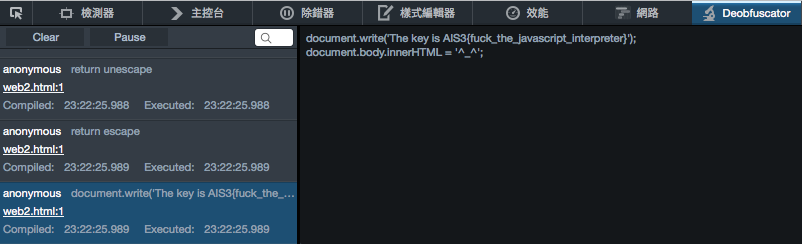

## misc-1

`The key is AIS3{hello_world}`

## misc-2

Use pkcrack to decrypt `key.txt`.

Here is the image:


``` sh
mkdir p960x960
curl https://fbcdn-dragon-a.akamaihd.net/hphotos-ak-prn1/p960x960/851556_443281069111871_602278786_n.png \
     -o p960x960/851556_443281069111871_602278786_n.png
zip fb_plain.zip p960x960/851556_443281069111871_602278786_n.png
pkcrack -C facebook.zip -c p960x960/851556_443281069111871_602278786_n.png \
        -P fb_plain.zip -p p960x960/851556_443281069111871_602278786_n.png \
        -d clean.zip -a
unzip clean.zip key.txt
```

## misc-3

c4 is a gzip compressed tarball and unpack it to get a bitmap file.

you will see some fuzzy words through fill tool and
use `hexdump c4.bmp` you will figure out a lot f all 0xff rows.

Here's a one-line solution:

``` sh
sed -i "s/\xff/\x00/g" b.bmp
```


## web-1

There is a local file inclusion vulnerability:

`http://52.69.163.194/web1/?page=php://filter/convert.base64-encode/resource=index`

And you can see the flag in the comment of php code.

( @orangetw told me this :P )

## web-2

[JavaScript Deobfuscator](https://github.com/palant/jsdeobfuscator) plugin for Firefox is your friend.



## web-3

Post payload is `username=root&password=\' or 1=1 #\`.

Don't ask me. I just fuzz it manually and I HATE WEB!

## bin-1

This is a packed PE with upx shell, but it was modified manually, so we can't just do `upx -d`.

You can just simply unpack it by
[this metohd](http://www.behindthefirewalls.com/2013/12/unpacking-upx-file-manually-with-ollydbg.html),
and you can analyze it now!

1. run it
2. open [Cheat Engine](http://cheatengine.org/)
3. scan string for `AIS3{` and you got the flag

## bin-2

This one is x64 shellcode.

``` sh
python2 -c "print \"$(tr -d '\r' < sc.txt | tr -d '\n')\"" | \
ndisasm -b64 -
```

```
// obviously, they are output content
00000000  48B8B5A3B9B1C641  mov rax,0x414141c6b1b9a3b5
         -4141
0000000A  50                push rax
0000000B  48B8BCA0A993AAA3  mov rax,0x93bea3aa93a9a0bc
         -BE93
00000015  50                push rax
00000016  48B8A993A5BF93BF  mov rax,0xa1a5bf93bfa593a9
         -A5A1
00000020  50                push rax
00000021  48B8BFA4A9A0A0AF  mov rax,0xa8a3afa0a0a9a4bf
         -A3A8
0000002B  50                push rax
0000002C  48B88D859FFFB7A3  mov rax,0x93a7a3b7ff9f858d
         -A793
00000036  50                push rax
00000037  4889E6            mov rsi,rsp
0000003A  4831D2            xor rdx,rdx
0000003D  803416CC          xor byte [rsi+rdx],0xcc // xor key
00000041  FEC2              inc dl
00000043  80FA25            cmp dl,0x25 // length
00000046  75F5              jnz 0x3d
00000048  4831C0            xor rax,rax
0000004B  48FFC0            inc rax
0000004E  4889C7            mov rdi,rax
00000051  0F05              syscall
00000053  6A3C              push byte +0x3c
00000055  58                pop rax
00000056  4831FF            xor rdi,rdi
00000059  0F05              syscall
0000005B  0A                db 0x0a

```

``` sh
python2 -c "print \"$(tr -d '\r' < sc.txt | tr -d '\n')\"" | \
ndisasm -b64 - | grep -o 'mov rax,\w\+' | \
tac | cut -b 11- | \
python2 -c 'import sys
data = sys.stdin.read().split()
data = map(lambda x: int(x, 16), data)
data = map(lambda x: x ^ 0xcccccccccccccccc, data)
data = map(lambda x: "%.16x" % x, data)
data = map(lambda x: x.decode("hex"), data)
data = map(lambda x: x[::-1], data)
print "".join(data)[:0x25]'
```

## bin-3

TBA

## pwn-1

TBA

## pwn-2

TBA

## pwn-3

TBA

## crypto-1

TBA

## crypto-2

TBA

## crypto-3

QAQ
