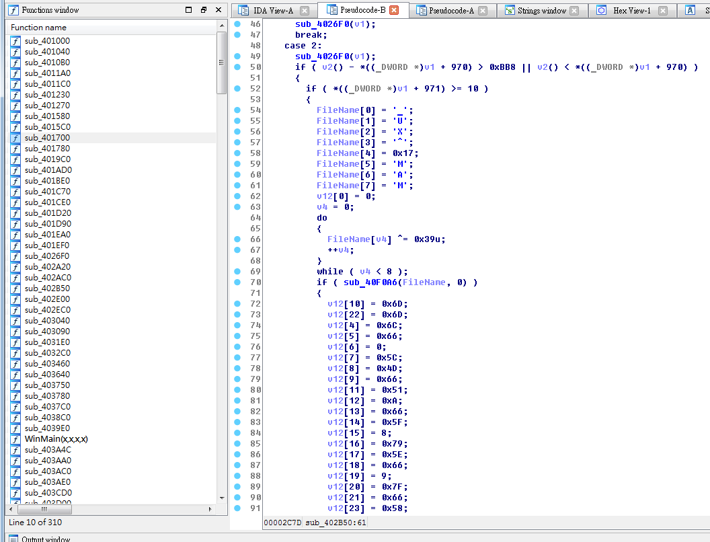
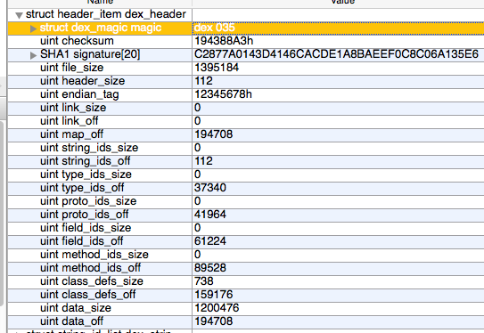
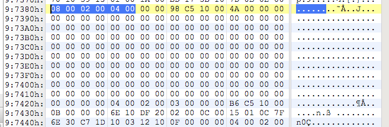

# tank (rev200)

還沒搞懂怎麼發射武器，但是翻著翻著就看到 Key 了



``` python
import re

def solve(data):
    f = [0] * 32
    data = data.split('\n')[1:-1]
    for i in data:
        m = re.search(r'(\d+)\] = (\w+)', i)
        index, val = m.groups()
        if val.startswith('0x'):
            val = val[2:]
        f[int(index)] = int(val, 16)

    def xor(a, b):
        if len(a) < len(b): a, b = b, a
        b = b * (len(a) // len(b)) + b
        return bytearray( i ^ j for i, j in zip(a, b))

    print(xor(f, [0x39]))

data = """
v12[10] = 0x6D;
v12[22] = 0x6D;
v12[4] = 0x6C;
v12[5] = 0x66;
v12[6] = 0;
v12[7] = 0x5C;
v12[8] = 0x4D;
v12[9] = 0x66;
v12[11] = 0x51;
v12[12] = 0xA;
v12[13] = 0x66;
v12[14] = 0x5F;
v12[15] = 8;
v12[16] = 0x79;
v12[17] = 0x5E;
v12[18] = 0x66;
v12[19] = 9;
v12[20] = 0x7F;
v12[21] = 0x66;
v12[23] = 0x58;
v12[24] = 0x57;
v12[25] = 0x52;
v12[26] = 0x7E;
v12[27] = 0x58;
v12[28] = 0x54;
v12[29] = 0x5C;
"""

solve(data)
```

# x xor md5 (crypto100)

```
00000000: 6935 4101 1c9e 7578 5d48 fbf0 84cd 6679  i5A...ux]H....fy
00000010: 5530 494c 56d2 7370 1245 a8ba 85c0 3e53  U0ILV.sp.E....>S
00000020: 731b 782a 4be9 7726 5e73 bfaa 859c 156f  s.x*K.w&^s.....o
00000030: 542c 731b 588a 6648 5b19 84b0 80ca 3373  T,s.X.fH[.....3s
00000040: 5c52 0c4c 109e 3237 120c fbba cb8f 6a53  \R.L..27......jS
00000050: 0178 0c4c 109e 3237 120c fbba cb8f 6a53  .x.L..27......jS
00000060: 0178 0c4c 109e 3237 120c fbba cb8f 6a53  .x.L..27......jS
00000070: 0178 0c4c 109e 3237 120c 89d5 a2fc       .x.L..27......
```

先猜 ASCII，下面應該都是 null

`xortool-xor -f xmd5 -h 01780c4c109e3237120cfbbacb8f6a53 | xxd`

```
00000000: 684d 4d4d 0c00 474f 4f44 004a 4f42 0c2a  hMMM..GOOD.JOB.*
00000010: 5448 4500 464c 4147 0049 5300 4e4f 5400  THE.FLAG.IS.NOT.
00000020: 7263 7466 5b77 4511 4c7f 4410 4e13 7f3c  rctf[wE.L.D.N..<
00000030: 5554 7f57 4814 547f 4915 7f0a 4b45 5920  UT.WH.T.I...KEY
00000040: 5d2a 0000 0000 0000 0000 0000 0000 0000  ]*..............
00000050: 0000 0000 0000 0000 0000 0000 0000 0000  ................
00000060: 0000 0000 0000 0000 0000 0000 0000 0000  ................
00000070: 0000 0000 0000 0000 0000 726f 6973       ..........rois
```

`hMMM` 看起來怪怪的，轉大寫（xor 0x20）

`xortool-xor -f xmd5 -h 01780c4c109e3237120cfbbacb8f6a53 -h 20 | xxd`

```
00000000: 486d 6d6d 2c20 676f 6f64 206a 6f62 2c0a  Hmmm, good job,.
00000010: 7468 6520 666c 6167 2069 7320 6e6f 7420  the flag is not
00000020: 5243 5446 7b57 6531 6c5f 6430 6e33 5f1c  RCTF{We1l_d0n3_.
00000030: 7574 5f77 6834 745f 6935 5f2a 6b65 7900  ut_wh4t_i5_*key.
00000040: 7d0a 2020 2020 2020 2020 2020 2020 2020  }.
00000050: 2020 2020 2020 2020 2020 2020 2020 2020
00000060: 2020 2020 2020 2020 2020 2020 2020 2020
00000070: 2020 2020 2020 2020 2020 524f 4953 0a              ROIS.
```

看起來接近了，但是 offset 0x2f 的 `1c` 和 0x3f 的 `00` 看起來怪怪的，bruteforce -> 0x0f, 0x1f：不要英文或數字

``` python
def not_english_char(ascii):
    return ascii not in range(0x41, 0x41 + 26) and \
           ascii not in range(0x61, 0x61 + 26)

for i in range(256):
    data = [i^j for j in (0x0a, 0x20, 0x1c, 0x00)]
    if all(j in range(0x20, 0x7f) or j == 0x0a for j in data) and \
            not_english_char(data[0]) and not_english_char(data[1]):
        print('%.2x %.2x %.2x %.2x' % tuple(data), ''.join(map(chr, data)))
        print('key = %.2x' % i)


# Result
"""
20 0a 36 2a
6*
key = 2a
"""
```

`xortool-xor -f xmd5 -h 01780c4c109e3237120cfbbacb8f6a53 -h 20 -h 0000000000000000000000000000002a | xxd`

```
00000000: 486d 6d6d 2c20 676f 6f64 206a 6f62 2c20  Hmmm, good job,
00000010: 7468 6520 666c 6167 2069 7320 6e6f 740a  the flag is not.
00000020: 5243 5446 7b57 6531 6c5f 6430 6e33 5f36  RCTF{We1l_d0n3_6
00000030: 7574 5f77 6834 745f 6935 5f2a 6b65 792a  ut_wh4t_i5_*key*
00000040: 7d0a 2020 2020 2020 2020 2020 2020 200a  }.             .
00000050: 2020 2020 2020 2020 2020 2020 2020 200a                 .
00000060: 2020 2020 2020 2020 2020 2020 2020 200a                 .
00000070: 2020 2020 2020 2020 2020 524f 4953 0a              ROIS.

Hmmm, good job, the flag is not
RCTF{We1l_d0n3_6ut_wh4t_i5_*key*}


          ROIS
```

現在看起來就很合理了

`RCTF{We1l_d0n3_6ut_wh4t_i5_*key*}` 不是 flag，檔名 x_xor_md5 ，所以猜測 xor key 應該是一組 MD5 hash

`md5("that") == "21582c6c30be1217322cdb9aebaf4a59"`

`RCTF{We1l_d0n3_6ut_wh4t_i5_that}`

# Flag system (mobile100)

``` java
public void onItemClick(AdapterView<?> paramAdapterView, View paramView, int paramInt, long paramLong) {
    if (this.mCursor != null) {
        this.mCursor.moveToPosition(paramInt);
        this.BOOK_ID = this.mCursor.getInt(0);
        if ("Flag".equals(this.mCursor.getString(1))) {
            this.BookName.setText("Guess");
            this.BookAuthor.setText("Flag is here!");
        }
    } else {
        return;
    }
    this.BookName.setText(this.mCursor.getString(1));
    this.BookAuthor.setText(this.mCursor.getString(2));
}

/********************************************/

public View getView(int paramInt, View paramView, ViewGroup paramViewGroup) {
    TextView localTextView = new TextView(this.mContext);
    if (this.mCursor == null) {
        return localTextView;
    }
    this.mCursor.moveToPosition(paramInt);
    if ("Flag".equals(this.mCursor.getString(1))) {
        localTextView.setText("Flag is here!");
        return localTextView;
    }
    localTextView.setText(this.mCursor.getString(1) + "___" + this.mCursor.getString(2));
    return localTextView;
}

/********************************************/

public BooksDB(Context paramContext) {
    super(paramContext, "BOOKS.db", null, 1);
    this.k = Test.getSign(paramContext); // sqlcipher encryption key
    this.db = getWritableDatabase(this.k);
    this.dbr = getReadableDatabase(this.k);
}

public static String getSign(Context paramContext)
{
    Iterator localIterator = paramContext.getPackageManager().getInstalledPackages(64).iterator();
    PackageInfo localPackageInfo;
    do {
        if (!localIterator.hasNext()) {
            return "";
        }
        localPackageInfo = (PackageInfo)localIterator.next();
    } while (!localPackageInfo.packageName.equals(paramContext.getPackageName()));
    return SHA1(localPackageInfo.signatures[0].toCharsString());
}
```

一直不知道為什麼listview沒出現，後來繼續看了看發現是 sqlcipher，寫個 App 抓 signature (key) -> `320b42d5771df37906eee0fff53c49059122eeaf`
後來用 commandline tool 發現打不開 BOOKS.db，覺得應該是 .so 被改過，所以另外寫個 App 調用 sqlcipher，換掉 .so，成功拿 flag

```
V/FLAG    ( 5353): 3082033b30820223a00302010202047c9646b8300d06092a864886f70d01010b0500304d310a30080603550406130133310b300906035504081302666a310b300906035504071302666a310b3009060355040a1302666a310b3009060355040b1302666a310b300906035504031302666a3020170d3135313031373033333535375a180f32353135303631383033333535375a304d310a30080603550406130133310b300906035504081302666a310b300906035504071302666a310b3009060355040a1302666a310b3009060355040b1302666a310b300906035504031302666a30820122300d06092a864886f70d01010105000382010f003082010a028201010086db1654ff0b4f70978fcbad8d08a47dcc4151e0577e3936819ae228ed55baf0d02edb9729d5022b35bbb906b6d3c5ea57d4709aad48784d4652b37d958e2045a0feafaeced086d5d5923550ac1910768bfeee6e18356d0648834017b7813b72db26a9f9f8ce1166ab8e294122f75664b4f363ed759350537c4b3dbc52bfde8c89ff082ea0ac8d780585a5759e44579707ae418f87aad544ee18855f31dbc80fa553559d8c001658f6bd39866a83b9bcff8b5a3bd023cb703119073975fe9f3a5f144ad0ba8d1877481b94e35b60b7aac6e3bdb52bbfd6c3c723755bccfaee1812a5c6761254104f5a3f5a74401b0c4d7fc5044e87f60e0151c89baf4e58deb10203010001a321301f301d0603551d0e041604145b9671a70bfe031bdcc430feb602177bb036f93a300d06092a864886f70d01010b050003820101003f61a3e13483427d538c046b84fa927e6116ef58b3db6f3bcb2efd2ea7bb46e93f37f8ecea4f899b7252340d3112838bfa9cbb6858f89f445dd2bccaa4f4817db624ebf859290ac16bc8f7d7445736f015b2cb2b7a43c08f998d0dda523a9909477ef86d4aa93c40b505ddd21aea40ce46857c58fd2fb52cf2d25715fa7c31b6d80dc0a165f06cd2efadece097d80369c391b8b3e9be41ac553c14a6bfaea293a149336e0ecad440d69ca4fb77e16af75d694383d57543be412ee4165a662000c7fcc0a3b995714dfd5803288ceab6a4eeca850bfec67bd114148728e280019e4e1907ea9b14a86d28feb2d1ea7a159095601f1ba97a441dfb44ddba1ba08441
V/FLAG    ( 5353): 320b42d5771df37906eee0fff53c49059122eeaf


......


I/Database( 4364): JNI_OnLoad called
I/Database( 4364): JNI_OnLoad register methods
D/K       ( 4364): net.sqlcipher.CrossProcessCursorWrapper@5285cab8
D/K       ( 4364): CC
D/K       ( 4364): Someting in the DB!!.
D/K       ( 4364): ==== Fetch Row ====
D/K       ( 4364): flag1,TEST@bbaaaa
D/K       ( 4364): flag2,qpalzmGGGG
D/K       ( 4364): flag3,bbc~Gooogle
D/K       ( 4364): Flag,TruefLag!backuuuuuP
D/K       ( 4364): flag5,QPALYYY123
D/K       ( 4364): flag6,flaTag
D/K       ( 4364): =========================
```


# Where (mobile300)

assets/flag：好吧，其实这是misc

我靠 =    =+

``` java
public void onClick(View paramAnonymousView)
{
    String str1 = MainActivity.this.etUserName.getText().toString();
    String str2 = MainActivity.this.etPassWord.getText().toString();
    if ((str1 != null) && (str2 != null))
    {
        if (str1.length() != str2.length()) {
            break label113;
        }
        if (!str1.equals(new StringBuffer(str2).reverse().toString())) {}
    }
    else
    {
        try
        {
            Toast.makeText(MainActivity.this, Utils.getFlag(MainActivity.this), 1).show();
            return;
        }
        catch (IOException localIOException)
        {
            localIOException.printStackTrace();
            return;
        }
    }
    Toast.makeText(MainActivity.this, "wrong", 1).show();
    return;
label113:
    Toast.makeText(MainActivity.this, "wrong", 1).show();
}
```

發現有奇怪的檔案

```
$ ls -l META-INF assets
META-INF:
total 1440
-rw-r--r-- 1 inndy staff 1396395 11 14 15:58 CERT.RSA
-rw-r--r-- 1 inndy staff   36340 11 14 15:58 CERT.SF
-rw-r--r-- 1 inndy staff   36219 11 14 15:58 MANIFEST.MF
-rw-r--r-- 1 inndy staff     148 11 14 15:58 y

assets:
total 8
-rw-r--r-- 1 inndy staff 112 11 14 15:58 abc
-rw-r--r-- 1 inndy staff  25 11 14 15:58 flag
$ xxd META-INF/y
00000000: 1205 6f20 4d13 7600 1402 1800 037f 6e20  ..o M.v.......n
00000010: e320 2600 2201 2d04 5462 7d0b 7020 7021  . &.".-.Tb}.p p!
00000020: 2100 1212 1a03 7b15 6e40 7b21 5132 1252  !.....{.n@{!Q2.R
00000030: 1263 1a04 d600 6e40 7b21 2143 1302 0a00  .c....n@{!!C....
00000040: 1303 0b00 1a04 8712 6e40 7b21 2143 1272  ........n@{!!C.r
00000050: 1303 0800 1a04 c003 6e40 7b21 2143 6e10  ........n@{!!Cn.
00000060: 7c21 0100 0c00 2202 2d04 1a03 d512 7020  |!....".-.....p
00000070: 7021 3200 6e20 7621 0200 0c02 6e10 7c21  p!2.n v!....n.|!
00000080: 0200 0c02 7130 da20 2605 0c02 6e10 dc20  ....q0. &...n..
00000090: 0200 0e00                                ....
$ xxd assets/abc
00000000: 6465 780a 3033 3500 a388 4319 c287 7a01  dex.035...C...z.
00000010: 43d4 146c acde 1a8b aeef 0c8c 06a1 35e6  C..l..........5.
00000020: f049 1500 7000 0000 7856 3412 0000 0000  .I..p...xV4.....
00000030: 0000 0000 94f8 0200 0000 0000 7000 0000  ............p...
00000040: 0000 0000 dc91 0000 0000 0000 eca3 0000  ................
00000050: 0000 0000 28ef 0000 0000 0000 b85d 0100  ....(........]..
00000060: e202 0000 c86d 0200 5c51 1200 94f8 0200  .....m..\Q......
```

- assets/abc 是個 dex 檔頭，body不見了
- META-INF/CERT.RSA 異常的大
- META-INF/y 看不出來是什麼

經過 strings 觀察 META-INF/CERT.RSA 發現有 `KEY=Misc@inf0#fjhx11`, `DEX=`, `aes-128-cbc` 等字串

```
000004c0: 2d79 89d0 fb09 e913 ebfc eefa 4f85 52cb  -y..........O.R.
000004d0: 5dcb 348f ac84 9b45 e4b9 576d e016 c488  ].4....E..Wm....
000004e0: 61fe eaca bafb 24f6 1368 5115 1b38 b5f3  a.....$..hQ..8..
000004f0: 5679 3b2b d674 b04b 4559 3d4d 6973 6340  Vy;+.t.KEY=Misc@
00000500: 696e 6630 2366 6a68 7831 3100 4445 583d  inf0#fjhx11.DEX=
00000510: 1717 6687 6cd0 1016 4046 90e4 9a4d f3d9  ..f.l...@F...M..
00000520: ba35 dcc2 e947 edfa 1908 5482 5705 a1cb  .5...G....T.W...

...

00154e80: 1efc c6c5 ca4c 494c 0e46 a15e d328 4413  .....LIL.F.^.(D.
00154e90: bd18 7cce d3bc 0ccd 4993 5350 f69b 6be6  ..|.....I.SP..k.
00154ea0: 6165 732d 3132 382d 6362 63              aes-128-cbc
```

```
$ openssl enc -d -aes-128-cbc -in body -out decrypted -k 'Misc@inf0#fjhx11' -nosalt
```

組合完成後發現這個 DEX 有問題，發現 table size 被清掉了



修好後反編譯可以看到

``` java
public class MainActivity extends ActionBarActivity
{
    public String seed = "m3ll0t_yetFLag";

    protected void onCreate(Bundle paramBundle);

    public boolean onCreateOptionsMenu(Menu paramMenu) {
        getMenuInflater().inflate(2131492864, paramMenu);
        return true;
    }

    public boolean onOptionsItemSelected(MenuItem paramMenuItem)
    {
        if (paramMenuItem.getItemId() == 2131034172) {
            return true;
        }
        return super.onOptionsItemSelected(paramMenuItem);
    }
}
```


但是 `m3ll0t_yetFLag` 不是 flag，dump smali 想找更詳細的東西，卻發現 `onCreate` 內有大量 nop

``` smali
.method protected onCreate(Landroid/os/Bundle;)V
    .registers 8
    .param p1, "savedInstanceState"
    .prologue
    nop
    .line 15
    nop; nop; nop
    .line 16
    nop;nop;nop;nop;nop;nop
    .line 17
    nop;nop;nop;nop;nop;nop;nop
    .line 18
    .local v1, "strb":Ljava/lang/StringBuilder;
    nop;nop;nop;nop;nop;nop
    .line 19
    nop;nop;nop;nop;nop;nop;nop
    .line 20
    nop;nop;nop;nop;nop;nop;nop;nop;nop
    .line 21
    nop;nop;nop;nop;nop;nop;nop;nop
    .line 22
    nop;nop;nop;nop
    .line 23
    .local v0, "flag":Ljava/lang/String;
    nop;nop;nop;nop;nop;nop;nop;nop;nop;nop;nop;nop;nop;nop;nop;nop;nop;nop;nop;nop;nop;nop
    .line 24
    nop
.end method
```

推測應該是被 patch 過，猜測 `META-INF/y` 其實是遺失的 code，根據 [https://source.android.com/devices/tech/dalvik/dex-format.html#code-item](https://source.android.com/devices/tech/dalvik/dex-format.html#code-item) 可以知道 `code_item` 的格式，加上 `dexdump` 得出以下資訊

```
  Virtual methods   -
    #0              : (in Lcom/example/hello/MainActivity;)
      name          : 'onCreate'
      type          : '(Landroid/os/Bundle;)V'
      access        : 0x0004 (PROTECTED)
      code          -
      registers     : 8
      ins           : 2
      outs          : 4
      insns size    : 74 16-bit code units
      catches       : (none)
      positions     : 
        0x0001 line=15
        0x0004 line=16
        0x000a line=17
        0x0011 line=18
        0x0017 line=19
        0x001e line=20
        0x0027 line=21
        0x002f line=22
        0x0033 line=23
        0x0049 line=24
      locals        : 
        0x0033 - 0x004a reg=0 flag Ljava/lang/String; 
        0x0011 - 0x004a reg=1 strb Ljava/lang/StringBuilder; 
        0x0000 - 0x004a reg=6 this Lcom/example/hello/MainActivity; 
        0x0000 - 0x004a reg=7 savedInstanceState Landroid/os/Bundle;
```

可以寫出特徵 `08 00 02 00 04 00` 找到


發現只有這個位址後面有一堆 `00` ，大小也剛好符合 `META-INF/y`



寫回去後反編譯

``` java
public String seed = "m3ll0t_yetFLag";

protected void onCreate(Bundle paramBundle)
{
    super.onCreate(paramBundle);
    setContentView(2130903064);
    StringBuilder localStringBuilder = new StringBuilder(this.seed);
    localStringBuilder.replace(0, 1, "h");
    localStringBuilder.replace(5, 6, "2");
    localStringBuilder.replace(10, 11, "f");
    localStringBuilder.replace(7, 8, "G");
    String str = localStringBuilder.toString();
    Toast.makeText(this, "flag is " + str, 0).show();
}
```

`h3ll02_GetfLag`