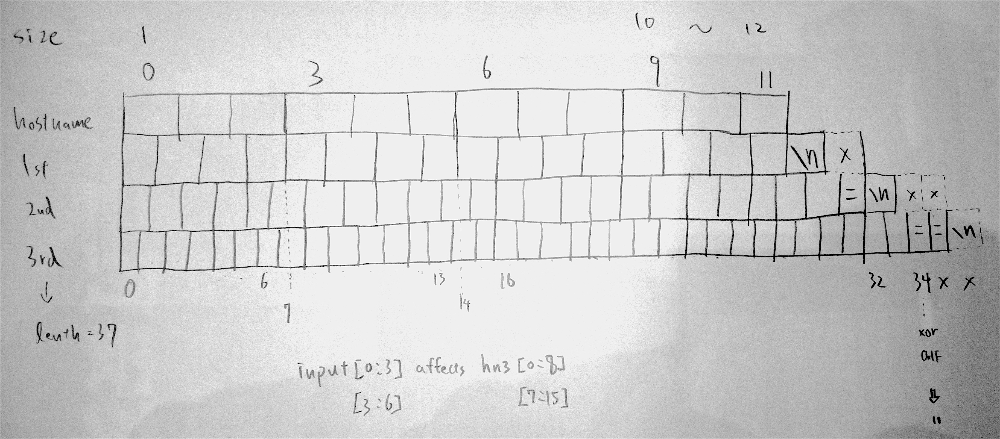
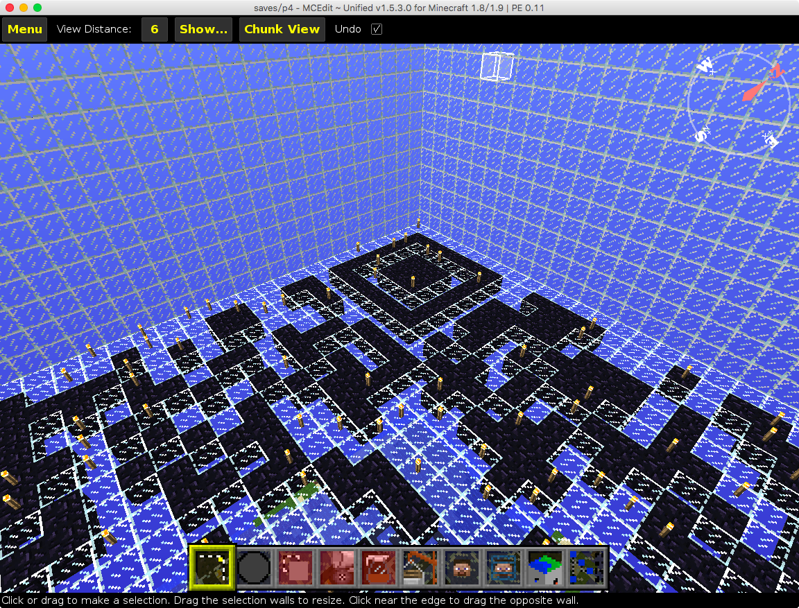
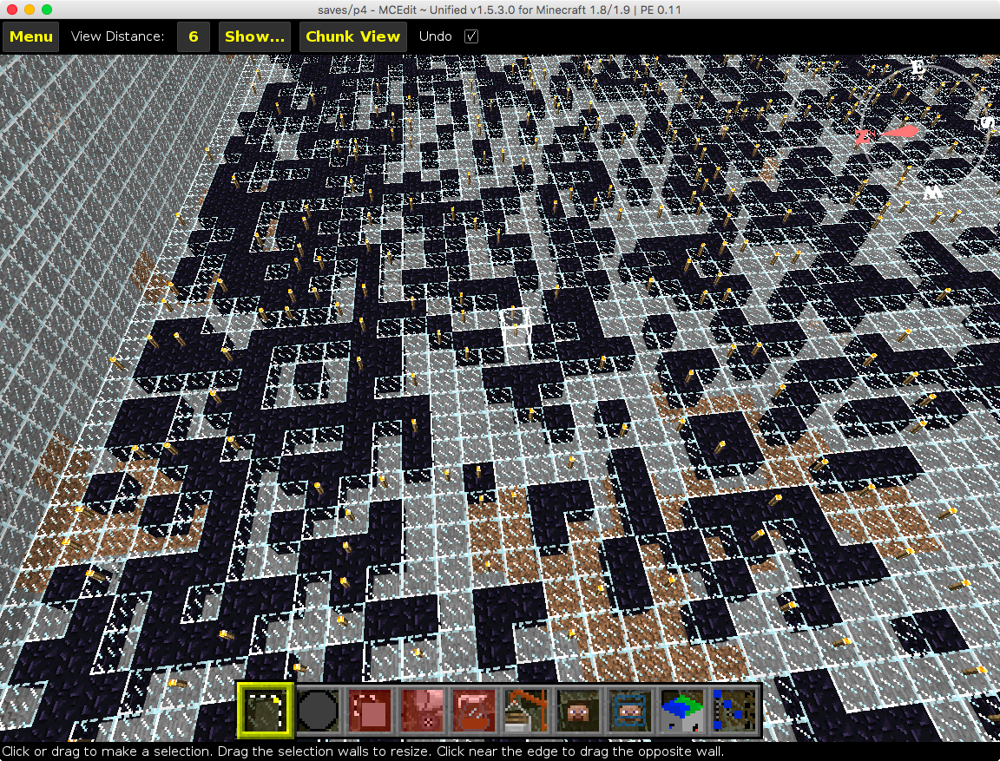
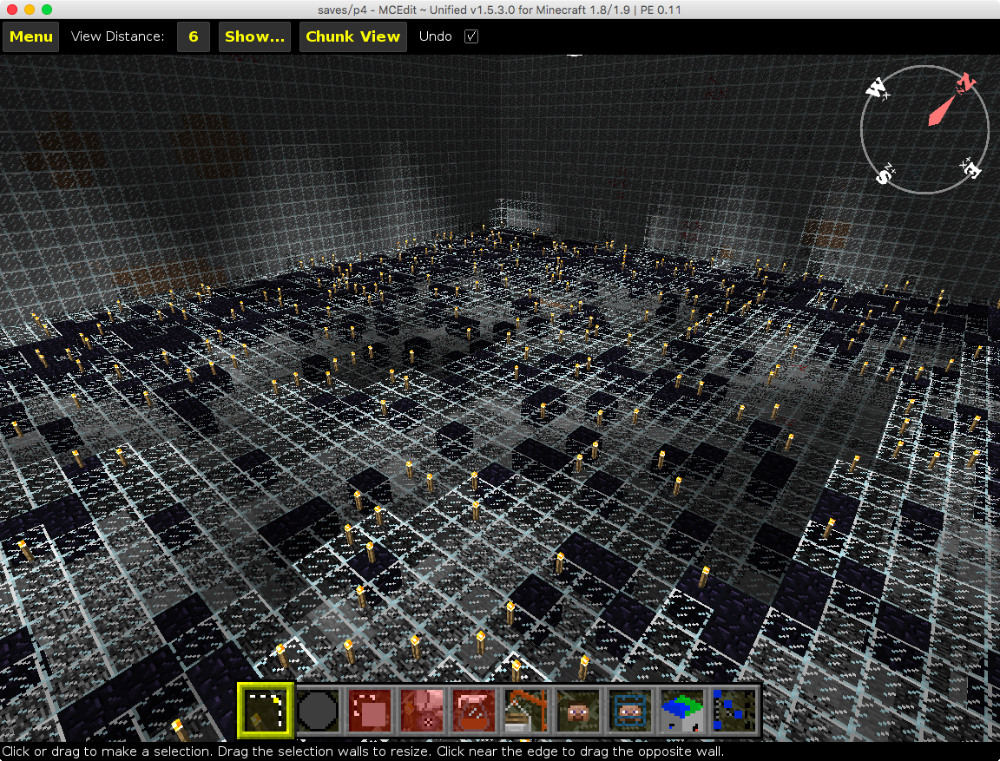
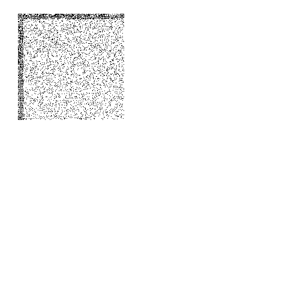
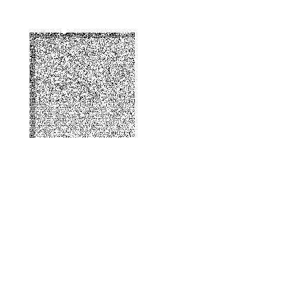
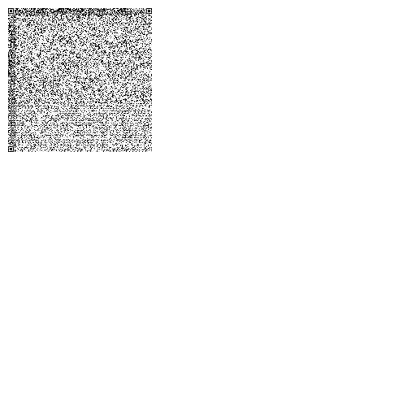
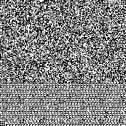
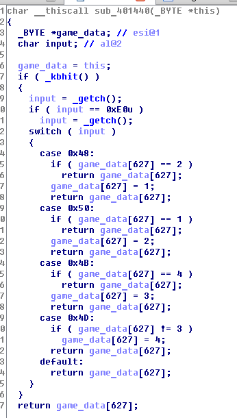
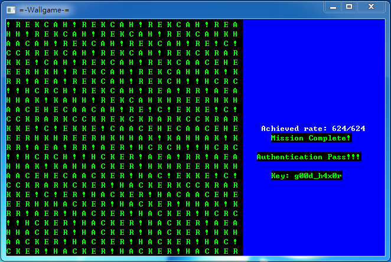

# p1. 開門見山

```
inndy ~$ echo wc221azsp94K | base64 -d | iconv -f big5
趨勢科技
```

# p2. 猜猜我是誰

``` python
import socket

print '\nI will only \"run\" my code at the correct machine.'
enc = '\'&+\x05\x16Mp\x14=*\x07&\x0c\tX\x1f L\x0c[ 3D8\x15\x13\x04\n"#\x19\x18\x1f\t\x1f'
hn = socket.gethostname()
while True :
    hn = hn.encode('base64')
    if len (hn) > len (enc) : break

executeMe = ""
for i in range(0, len (enc)) :
    executeMe += chr(ord(enc[i]) ^ ord(hn[i]))

try :
    exec (executeMe)

except:
    print "\nSorry. This is not the correct machine."
```

35 bytes XORed python code

這題我解了大概快十個小時，首先要先通靈猜到他只有一個 print statement，並且使用雙引號，所以結構是：`print "***************************"`，對於這個假設其實是有跡可循的

``` python
def exp_key(hn):
    while True :
        hn = hn.encode('base64')
        if len(hn) > len(enc):
            return hn

def decrypt(hn):
    hn = exp_key(hn)
    executeMe = ""
    return ''.join(xor(hn[:len(enc)], enc))

for i in range(30):
    print i, decrypt('A'*i + '.com')
```

會得到

```
0 qK_Rw &ShrkpneJy'Z,u_J@xJ_pv,mJON
1 qKSdOfp|ouneJv|hotJ@xJ_pv,mJON
2 qKSdOnDUpnN
ptFoueOBx`_pv,mJON
3 qJqd@|9loDMJ_OIy!t,Cuo@K`Ztv,mJON
4 qJqd@|9loDIunOOv&BCu`vVNZtv,mJON
5 qJqd@|9loDIunO(Kv|V:ye`v[JDpv,mJON
6 qpqRD|6goF]um9(Qy Yjm_(KGGh[wt!!\n"    <---- !!!
7 qpqRD|6goF]um9(Lv|
                    Ce(IFK`[wt!!\n"    <---- !!!
8 qpqRD|6goF]um9(Lv Z
                     me mFGRast!!\n"    <---- !!!
9 qpqRD|6goF]um9(Lv Z:qpXF=a@viKJON
10 qpqRD|6goF]um9(Lv Z:qoAGBb@vu-K\N
11 qpqRD|6goF]um9(Lv Z:qoCx^atNm-K8w
12 rp}BG!6BoAMtZ\\uZqX<LA}^cww)!\n"    <---- !!!
13 rp}BG!6BoAMtZ\\uZq_l[DtcoIX!\n"    <---- !!!
14 rp}BG!6BoAMtZ\\uZq_nGKRPoIu(\n"
15 rp}BG!6BoAMtZ\\uZq_nGxNG@v,*FeZ
16 rp}BG!6BoAMtZ\\uZq_nGxNXwYOiFcV
17 rp}BG!6BoAMtZ\\uZq_nGxNXtvO)H]V
18 rp}BG!6BoAMtZ\\uZq_nGxNXtvC[KN.
19 rp}BG!6BoAMtZ\\uZq_nGxNXtvC[J_R
20 rp}BG!6BoAMtZ\\uZq_nGxNXtvC[J_I
21 vsmGG6VlAd]\]qJqfzDFBHnNWn}X"
22 vsmGG6VlAd]\]qJqfzDFBHsp,r};/
23 vsmGG6VlAd]\]qJqfzDFBHsv\mF;&
24 vsmGG6VlAd]\]qJqfzDFBHsv_ZSdQ
25 vsmGG6VlAd]\]qJqfzDFBHsv_ZNZ*
26 vsmGG6VlAd]\]qJqfzDFBHsv_ZN\Z
27 vsmGG6VlAd]\]qJqfzDFBHsv_ZN\Y
28 vsmGG6VlAd]\]qJqfzDFBHsv_ZN\Y
29 vsmGG6VlAd]\]qJqfzDFBHsv_ZN\Y
```

（後來得到提示，這是個美麗的誤會，應該會收到內部 hostname，而不是一個真實存在的 domain name，差點就去抓 [DNS census](https://dnscensus2013.neocities.org/)，但是157GB實在太扯了 XDDDD）

所以可以猜他是個 print，這是被 xor 過的東西，可以發現到 `0x1f ^ '=' == '"'` ，而 `=` 正好是 base64 padding char，特別的一點是， python2 裡面寫 `str.encode('base64')` 會在結尾加上一個 `'\n'`，根據剛剛的提示，重新測試

```python
for i in range(1, 15):
    print i, decrypt('A'*i)
```

```
1 qK1OCnDMvZd
Ly'Z,Cu4`vVJ_pv,mJON
2 qK1OCjrornbmLy'Z,Cu4`vVJ_pv,mJON
3 qK1OCjror[N0Ky ^
                  Cu4`vVJ_pv,mJON
4 qKSdOnrounbmKy'Z,u_J@xJ_pv,mJON
5 qKSdOnrounbmKy'V,vuJ@xJ_pv,mJON
6 qKSdOnrounbmKy'V,vu(mD}J_pv,mJON
7 qJqd@|9loDIunO(KyN,uo@K`Ztv,mJON
8 qJqd@|9loDIunO(KyN,uKC^Ztv,mJON
9 qJqd@|9loDIunO(KyN,uKC~BXof,mJON
10 qpqRD|6goF]um9(Lv Z:qoGGh[wt!!\n"   <--- !!!
11 qpqRD|6goF]um9(Lv Z:qoCx^[wt!!\n"   <--- !!!
12 qpqRD|6goF]um9(Lv Z:qoCx`Xx!!\n"   <--- !!!
13 qpqRD|6goF]um9(Lv Z:qoCx`X@fCKJON
14 qpqRD|6goF]um9(Lv Z:qoCx`X@fCOJeN
15 qpqRD|6goF]um9(Lv Z:qoCx`X@fCOJdk
```

``` python
def exp_key(hn):
    n = 0
    while True :
        n += 1
        hn = hn.encode('base64')
        if len(hn) > len(enc):
            return hn, n

for i in range(1, 30):
    _, n = exp_key('A'*i)
    print i, n

```

```
1 6
2 6
3 6
4 5
5 5
6 5
7 4
8 4
9 4
10 3
11 3
12 3
13 3
14 3
15 3
16 2
17 2
18 2
19 2
20 2
```

可以推敲出長度是在 10 ~ 12 之間最為合理，並且在這個長度下 hostname 會 base64 encode 三次，並且經過一個晚上，寫了 C 語言做 bruteforce，意外發現開頭有 `print "Foun` 的資料，隔天繼續以此為線索繼續搜尋，並且畫圖分析一下：



以此為基礎，一次猜測 2~3 個字，找出合理的文字往下推，就可以一步一步做出來了

```
00000000: 2726 2b05 164d 7014 3d2a 0726 0c09 581f  '&+..Mp.=*.&..X.
00000010: 204c 0c5b 2033 4438 1513 040a 2223 1918   L.[ 3D8...."#..
00000020: 1f09 1f                                  ...
```

```
ph-marvinc-m print "\nFound my home at last!!\n"
```

# p3. 躲貓貓

這不是 txt 是 jpg，東西藏在 exif

```
Image Description               : VGhpcyBmaWVsZCBpc24ndCBjdXJyZW50ISBHbyB0byBmaW5kIGFub3RoZXI=
Artist                          : TG9va3VwRVhJRkBDeWJlckhhY2tpbmch
Document Name                   : QmFkIGx1Y2shIFRyeSBhZ2FpbiE=
```

分別解出：

```
This field isn't current! Go to find another
LookupEXIF@CyberHacking!
Bad luck! Try again!
```

# p4. 人在車中坐，禍從天上來

首先用 MCEdit 觀察地圖，可以發現 Minecraft Pi 地圖檔案格式和 Minecraft Pocket Edition 是一樣的







用 [pymclevel](https://github.com/mcedit/pymclevel.git) 讀取地圖檔案，取出所有黑曜石的資料，三層分別如下（ref: [p4/stage1.py](p4/stage1.py)）





用影像處理軟題疊起來可以得到



Decode 後得到

```
00000000000000000000000000000000000
01111111000100101011110100011111110
01000001010000111100011001010000010
01011101010111011011001111010111010
01011101010001101001001011010111010
01011101011110011110010111010111010
01000001010011000000111101010000010
01111111010101010101010101011111110
00000000001110000110110100000000000
00010011110001010010000011101111100
00100100011100000010111010010010010
01000001000111011111010011010100010
00000000011111000010111001001010000
00011011110001000010001000011010110
00101110000100001001001010111011100
01110101100110100000110010000110010
00010000110000101010010010010010010
01101101010001000111100111011010000
00100110110011010001001011010001000
01010011111100111001010010110001010
00101110100101001111000111011110010
00010001011101101000110111110010010
00101100000111110000010001001001010
01101111100110001010010101111111010
00000100100100101011000111001010110
01111011110100001101010001111100000
00000000011111011001000101000111010
01111111011101111101101101010100110
01000001011111010011010111000110100
01011101001110011010001111111110110
01011101001100011011100111101100100
01011101011101000110010001010101110
01000001000100110101001011001110000
01111111000011101100000001110010010
00000000000000000000000000000000000
```

拼起來可以得到（ref: [p4/stage2.py](p4/stage2.py)）


掃出來會看到

```
You Win! https://goo.gl/cvNaab
```

備份一下最後機歪的葫蘆猴：


# p5. 我是遊戲高手

這題很簡單，把 non-blocking IO 變成 blocking IO 就好了，關鍵在這裡，跳過 _kbhit 的檢查即可



Patch:

```
0040144a:
db 90 90
```

然後就可以慢慢走完貪食蛇了


