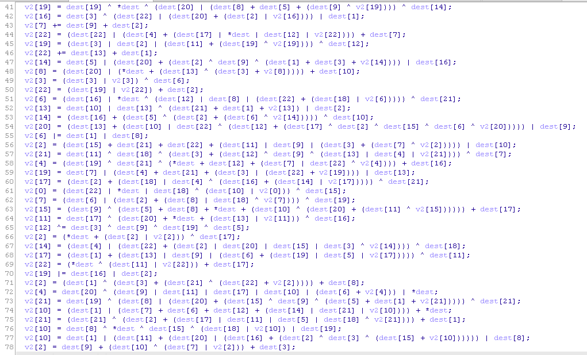

# bin3



看了第一眼就不想繼續看了...直接上 [angr](http://angr.io/)

script 在 [bin3/solve-bin3.py](bin3/solve-bin3.py)

```
(angr)angr@69ca4cf2299d:~$ python solve-bin3.py
[<Path with 193 runs (at 0x402471)>]
ais3{a XOR b XOR 1oo1l}@@@@@@@
```

`ais3{a XOR b XOR 1oo1l}`
