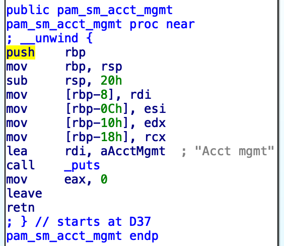
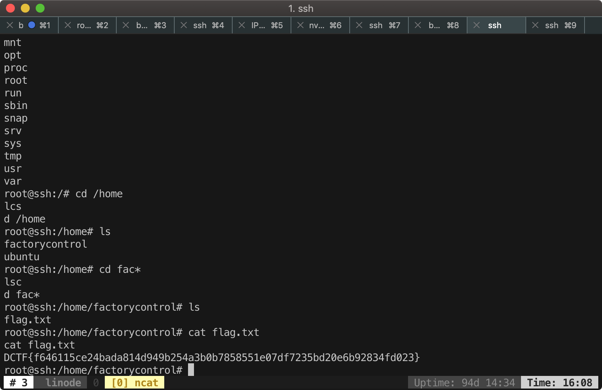

# UltimateSecure

## Overview

This challenge contains a shared-library which appears to be a [Linux PAM](https://en.wikipedia.org/wiki/Linux_PAM). During the contest, hosts update the challenge with a [easier one](chall/UltraSecure-2.so). The description only contains the module itself and a ip address. After port scanning, we found only port 22 was opened, so we have to exploit this PAM through SSH.



```c
int __cdecl pam_sm_authenticate(void *pamh, int flags, int argc, const char **argv)
{
  int result; // eax
  size_t input_password_len; // rax
  __int64 encoded_length; // [rsp-70h] [rbp-70h]
  char local_buffer[24]; // [rsp-68h] [rbp-68h]
  size_t decoded_length; // [rsp-50h] [rbp-50h]
  const char *input_password; // [rsp-48h] [rbp-48h]
  const char *input_username; // [rsp-40h] [rbp-40h]
  char *encoded_text; // [rsp-28h] [rbp-28h]
  FILE *fp; // [rsp-20h] [rbp-20h]
  int status; // [rsp-14h] [rbp-14h]
  const void *decoded_password; // [rsp-10h] [rbp-10h]

  input_password = NULL;
  decoded_password = NULL;
  status = (unsigned int)pam_get_user(pamh, &input_username, "Username: ");
  printf("Welcome %s\n", input_username);
  if ( status )
    return status;
  if ( strcmp(input_username, "factorycontrol") )
    return 7;
  status = pam_get_authtok(pamh, 6LL, &input_password, 0LL);
  if ( status )
    return status;
  input_password_len = strlen(input_password);
  decoded_password = (const void *)base64_decode(input_password, input_password_len, &decoded_length);
  memcpy(local_buffer, decoded_password, decoded_length);
  fp = fopen("/tmp/file.txt", "w");
  if ( !fp )
  {
    puts("Error opening file!");
    exit(1);
  }
  encoded_text = base64_encode(local_buffer, decoded_length, & encoded_length);
  fprintf(fp, "Some text: %s\n", encoded_text);
  fprintf(fp, "Integer: %d, float: %f\n", 1LL, 3.1415927);
  fprintf(fp, "A character: %c\n", 65LL);
  fclose(fp);
  if ( !strcmp(
          local_buffer,
          "AAAAAAAAAAAAAAAAAAAAAAAAAAAAAAAAAAAAAAAAAAAAAAAAAAAAAAAAAAAAAAAAAAAAAAAAAAAAAAAAAAAAAAAAAAAAAAAAAAAAAAAAAAAAAA"
          "AAAAAAAAAAAAAAAAAAAAAAAAAAAAAAAAAAAAAAAAAAAAAAAAAAAAAAAAAAAAAAAAAAAAAAAAAAAAAAAAAAAAAAAAAAAAAAAAAAAAAAAAAAAAAA"
          "AAAAAAAAAAAAAAAAAAAAAAAAAAAAAAAAAAAAAAAAAAAAAAAAAAAAAAAAAAAAAAAAAAAAAAAAAAAAAAAAAAAAAAAAAAAAAAAAAAAAAAAAAAAAAA"
          "AAAAAAAAAAAAAAAAAAAAAAAAAAAAAAAAAAAAAAAAAAAAAAAAAAAAAAAAAAAAAAAAAAAAAAAAAAAAAAAAAAAAAAAAAAAAAAAAAAAAAAAAAAAAAA"
          "AAAAAAAAAAAAAAAAAAAAAAAAAAAAAAAAAAAAAAAAAAAAAAAAAAAAAAAAAAAAAAAAAAAAAAAAAAAAAAAAAAAAAAAAAAAAAAAAAAAAAAAAAAAAAA"
          "AAAAAAAAAAAAAAAAAAAAAAAAAAAAAAAAAAAAAAAAAAAAAAAAAAAAAAAAAAAAAAAAAAAAAAAAAAAAAAAAAAAAAAAAAAAAAAAAAAAAAAAAAAAAAA"
          "AAAAAAAAAAAAAAAAAAAAAAAAAAAAAAAAAAAAAAAAAAAAAAAAAAAAAAAAAAAAAAAAAAAAAAAAAAAAAAAAAAAAAAAAAAAAAAAAAAAAA") )
    result = 0;                                 // PAM_SUCCESS
  else
    result = 7;                                 // PAM_AUTH_ERR
  return result;
}
```

However, it's not possible to pass the "AAAAAAAAAAAAAAAAA" check, becase you will mess-up the return address and the program will just die.

## PAM backdoor and Vulnerability

The module makes me think of [PAM backdoor](https://github.com/eurialo/pambd). Basically, they're very similar and the code is very short. I install the module in my VM and was able to trigger it with `su factorycontrol`. When I input a long password, the `su` program crashed! Because `memcpy` will lead to stack buffer overflow. Great! But our goal is to exploit it remotely through SSH.

## Keyboard interactive authentication

I tried to login remote server with a long password, but nothing happend until I realized that SSH protocol has several ways to authenticate a user. When I was using [putty](https://www.putty.org/), the behavior was silent different from `ssh` command from UNIX system. So I tried using putty to login with a long password. Bingo! It says: "Server unexcpectedly closed network connection", which means `sshd` was crashed. Otherwise you might be informed that password was incorrect and have a second chance to input the password again.

After some digging, I found that [paramiko](https://www.paramiko.org/) can be used to interact with SSH. It has been used rectently in [libssh authentication bypass exploit](https://www.exploit-db.com/exploits/45638/). Also you can write a python script to work with [keybaord interactive authentication process](https://stackoverflow.com/questions/43903875/python-paramiko-client-multifactor-authentication).

## Paramiko

I made a simple script to send password and figure out that you will be prompted to input password twice if you had the wrong password. But if you input a very long password, the connection will be closed directly. BOOM! We had triggered stack buffer overflow with `paramiko`!

## Blind ROP

Sicne `sshd` is a `accept()` and `fork()` server, stack canary (stack canary is not presented in this challenge) and ASLR will not re-randomize across connections. What I tried to do is, overwrite return address a byte at a time, then check if the process crashed or not. If I overwrite the return address without causing the process crashing or hanging, it means I probably did not change the return address. I will be able to probe the return address by doing this repeatedly. And then we can perform attacks like [blind ROP](http://www.scs.stanford.edu/brop/).

## Grab the libpam

But we can exploit it faster by having the `libpam.so`. Fortunately, we can tell the version of operating system and `sshd` by version string sent by remote server.

```
$ nc 142.93.107.255 22
SSH-2.0-OpenSSH_7.2p2 Ubuntu-4ubuntu2.6
^C
```

I'm so lucky that I found a identical [`libpam.so`](libpam.so.0.83.1) from my teammate's Ubuntu VM.

## Locating the return address

In order to obain the return address offset in `libpam`, I wrote a PAM to dump memory mapping and return address.

```c
int pam_sm_authenticate(void *pamh)
{
  char cmdline[32];
  sprintf(cmdline, "cat /proc/%d/maps", getpid());
  system(cmdline);
  uint64_t *ptr = (void*)&pamh;
  for(int i = 0; i < 64; i++)
    printf("%p\n", ptr[i]); // it will cover the ret addr
  return PAM_SUCCESS;
}
```

So I know the return address offset in `libpam` now.

## Spawn a shell

All the pieces were gatherd! Last step is to find some useful ROP gadgets from `libpam` and spawn a shell. But we can't just call `execve("/bin/sh", NULL, NULL)` nor `system("sh")` since it's not a classic pwn challenge which redirect stdio through socket. We have to know the socket file descriptor and it's not that easy, so we choose to spawn a reverse shell.

I found that `libpam` uses `dlopen` and `dlsym` to load custom PAM, so we can use them to locate `system` function and spawn a shell. I encounterd some problem when calling `system`. After some test, I realized that `dysym` returned a null pointer. So I changed first arguemnt for `dlsym` to NULL (actually `RTLD_DEFAULT`). Finally, I got a reverse shell with root user!



[Here](blind.py) is the full exploit script.
